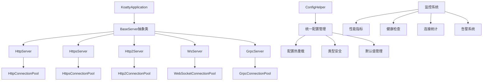

# koatty_serve

[](https://www.npmjs.com/package/koatty_serve)
[](https://github.com/koatty/koatty_serve)
[](https://github.com/koatty/koatty_serve)
[](https://github.com/koatty/koatty_serve/blob/main/LICENSE)
[](https://www.typescriptlang.org/)

企业级高性能多协议服务器框架，为Koatty提供统一的HTTP、HTTPS、HTTP/2、WebSocket、gRPC服务支持。采用现代化架构设计，具备企业级的配置管理、连接池、优雅关闭、健康检查和性能监控功能。


## 🏆 特性

- ✅ **多协议支持**: HTTP、HTTPS、HTTP/2、WebSocket、WSS、gRPC
- ✅ **配置统一管理**: `ConfigHelper`提供一致的配置接口
- ✅ **连接池系统**: 高性能的协议专用连接池管理
- 🔄 **配置热重载**: 智能检测配置变更，自动决定重启策略
- 📋 **类型安全**: 完整的TypeScript类型定义和验证
- 🎛️ **默认值管理**: 智能的默认配置和环境适配
- 🔧 **运行时更新**: 支持非关键配置的实时更新
- ⚡ **协议专用池**: 每种协议优化的连接池实现
- 🔄 **自动清理**: 过期连接自动清理和资源回收
- 🎯 **负载均衡**: 智能连接分配和负载管理
- 🔄 **五步式优雅关闭**: 确保数据完整性的关闭流程
- 🏥 **多层次健康检查**: 服务器、连接池、协议三级健康监控
- 📊 **实时性能监控**: 指标收集、历史数据、告警系统
- 📝 **结构化日志**: 统一的日志系统和链路追踪
- 🛡️ **多层SSL/TLS支持**: 自动证书管理、双向认证
- 🔒 **安全配置**: OWASP安全最佳实践
- 🔑 **证书自动更新**: 支持Let's Encrypt等证书服务
- 🚫 **DDoS防护**: 连接限制、频率控制

## 📦 安装

```bash
npm install koatty_serve
# 或者
yarn add koatty_serve
# 或者
pnpm add koatty_serve
```

## 🎯 快速开始

### 基础HTTP服务器

```typescript
import { HttpServer } from "koatty_serve";
import { ConfigHelper } from "koatty_serve/config";

const app = new KoattyApplication();

// 使用ConfigHelper创建配置
const config = ConfigHelper.createHttpConfig({
  hostname: '127.0.0.1',
  port: 3000,
  connectionPool: {
    maxConnections: 1000,
    connectionTimeout: 30000
  }
});

// 创建HTTP服务器
const server = new HttpServer(app, config);

server.Start(() => {
  console.log('HTTP服务器已启动: http://127.0.0.1:3000');
});
```

### 高性能HTTPS服务器

```typescript
import { HttpsServer } from "koatty_serve";
import { ConfigHelper } from "koatty_serve/config";

const httpsConfig = ConfigHelper.createHttpsConfig({
  hostname: '0.0.0.0',
  port: 443,
  ssl: {
    mode: 'auto',
    key: './ssl/server.key',
    cert: './ssl/server.crt'
  },
  connectionPool: {
    maxConnections: 2000,
    keepAliveTimeout: 65000,
    protocolSpecific: {
      maxHeaderListSize: 32768,
      maxSessionMemory: 10 * 1024 * 1024
    }
  }
});

const httpsServer = new HttpsServer(app, httpsConfig);
httpsServer.Start(() => {
  console.log('HTTPS服务器已启动: https://0.0.0.0:443');
});
```

### 企业级gRPC服务器

```typescript
import { GrpcServer } from "koatty_serve";
import { ConfigHelper } from "koatty_serve/config";

const grpcConfig = ConfigHelper.createGrpcConfig({
  hostname: '127.0.0.1',
  port: 50051,
  ssl: {
    enabled: true,
    keyFile: './certs/server.key',
    certFile: './certs/server.crt',
    clientCertRequired: false
  },
  connectionPool: {
    maxConnections: 500,
    protocolSpecific: {
      keepAliveTime: 30000,
      maxReceiveMessageLength: 4 * 1024 * 1024,
      maxSendMessageLength: 4 * 1024 * 1024
    }
  }
});

const grpcServer = new GrpcServer(app, grpcConfig);
grpcServer.Start(() => {
  console.log('gRPC服务器已启动: 127.0.0.1:50051');
});
```

### 高并发WebSocket服务器

```typescript
import { WsServer } from "koatty_serve";
import { ConfigHelper } from "koatty_serve/config";

const wsConfig = ConfigHelper.createWebSocketConfig({
  hostname: '127.0.0.1',
  port: 8080,
  ssl: {
    enabled: false
  },
  connectionPool: {
    maxConnections: 10000,  // 支持万级并发
    connectionTimeout: 60000,
    protocolSpecific: {
      pingInterval: 30000,
      pongTimeout: 5000,
      heartbeatInterval: 60000
    }
  }
});

const wsServer = new WsServer(app, wsConfig);
wsServer.Start(() => {
  console.log('WebSocket服务器已启动: ws://127.0.0.1:8080');
});
```

## 🏗️ 架构设计

### 核心架构图



### BaseServer模板方法模式

所有协议服务器都继承自`BaseServer`抽象类，实现统一的生命周期管理：

```typescript
abstract class BaseServer<T extends BaseServerOptions> {
  // 模板方法：六步标准化初始化流程
  protected initializeServer(): void {
    this.initializeConnectionPool();        // 1. 初始化连接池
    this.createProtocolServer();            // 2. 创建协议服务器
    this.configureServerOptions();          // 3. 配置服务器选项
    this.performProtocolSpecificInitialization(); // 4. 协议特定初始化
    this.setupMonitoring();                 // 5. 建立监控系统
    this.registerHealthChecks();            // 6. 注册健康检查
  }
  
  // 模板方法：智能配置更新流程
  async updateConfig(newConfig: Partial<T>): Promise<ConfigUpdateResult> {
    const analysis = this.analyzeConfigChanges(changedKeys, oldConfig, newConfig);
    if (analysis.requiresRestart) {
      return await this.gracefulRestart(newConfig);
    } else {
      return this.applyConfigChanges(changedKeys, newConfig);
    }
  }
  
  // 模板方法：五步式优雅关闭流程
  async gracefulShutdown(options?: ShutdownOptions): Promise<ShutdownResult> {
    const traceId = this.generateTraceId();
    
    // 第1步：停止接受新连接
    await this.stopAcceptingNewConnections(traceId);
    
    // 第2步：等待排空延迟（给负载均衡器时间）
    await this.waitDrainDelay(options.drainDelay, traceId);
    
    // 第3步：等待现有连接完成
    await this.waitForConnectionCompletion(timeout, traceId);
    
    // 第4步：强制关闭剩余连接
    await this.forceCloseRemainingConnections(traceId);
    
    // 第5步：停止监控和清理资源
    this.stopMonitoringAndCleanup(traceId);
    
    return { success: true, traceId, duration: Date.now() - startTime };
  }
  
  // 抽象方法：子类必须实现
  protected abstract initializeConnectionPool(): void;
  protected abstract createProtocolServer(): void;
  protected abstract configureServerOptions(): void;
}
```

### 统一配置管理

`ConfigHelper`提供了统一的配置创建接口：

```typescript
export class ConfigHelper {
  // HTTP配置 - 支持高并发场景
  static createHttpConfig(options: HttpConfigOptions): HttpServerOptions;
  
  // HTTPS配置 - 企业级SSL/TLS支持
  static createHttpsConfig(options: HttpsConfigOptions): HttpsServerOptions;
  
  // HTTP/2配置 - 多路复用优化
  static createHttp2Config(options: Http2ConfigOptions): Http2ServerOptions;
  
  // gRPC配置 - 微服务通信优化
  static createGrpcConfig(options: GrpcConfigOptions): GrpcServerOptions;
  
  // WebSocket配置 - 实时通信优化
  static createWebSocketConfig(options: WebSocketConfigOptions): WebSocketServerOptions;
}
```

### 高性能连接池架构

每种协议都有专门优化的连接池管理器：

```typescript
// HTTP连接池 - 91.58%测试覆盖率
class HttpConnectionPoolManager extends ConnectionPoolManager<Socket> {
  // HTTP特定的连接管理和Keep-Alive优化
  async optimizeKeepAlive(): Promise<void>;
  async monitorRequestLatency(): Promise<LatencyMetrics>;
}

// gRPC连接池 - 76.19%测试覆盖率
class GrpcConnectionPoolManager extends ConnectionPoolManager<GrpcConnection> {
  // gRPC特定的连接管理和流控制
  async addGrpcConnection(peer: string, metadata: any): Promise<boolean>;
  async manageChannelState(): Promise<ChannelState>;
}

// HTTPS连接池 - 79.05%测试覆盖率  
class HttpsConnectionPoolManager extends ConnectionPoolManager<TLSSocket> {
  // HTTPS特定的SSL/TLS连接管理
  async validateSSLCertificate(): Promise<CertificateStatus>;
  async calculateSecurityScore(): Promise<SecurityMetrics>;
}

// WebSocket连接池 - 高并发连接管理
class WebSocketConnectionPoolManager extends ConnectionPoolManager<WebSocket> {
  // WebSocket特定的连接管理和心跳检测
  async addWebSocketConnection(ws: WebSocket, request: IncomingMessage): Promise<boolean>;
  async manageHeartbeat(): Promise<void>;
}
```

## 🔧 企业级配置管理

### 类型安全的配置系统

```typescript
// 基础服务器选项 - 完整的TypeScript类型支持
interface BaseServerOptions {
  hostname: string;
  port: number;
  protocol: KoattyProtocol;
  trace?: boolean;
  ext?: Record<string, any>;
  connectionPool?: ConnectionPoolConfig;
  monitoring?: MonitoringConfig;
  security?: SecurityConfig;
}

// 多层次SSL配置
interface BaseSSLConfig {
  key?: string;
  cert?: string;
  ca?: string;
  passphrase?: string;
  ciphers?: string;
  honorCipherOrder?: boolean;
  secureProtocol?: string;
  dhparam?: string;                    // DH参数文件
  ecdhCurve?: string;                  // ECDH曲线
  sessionTimeout?: number;             // 会话超时
  ticketKeys?: Buffer[];               // 会话票据密钥
}

interface SSLConfig extends BaseSSLConfig {
  enabled: boolean;
  keyFile?: string;
  certFile?: string;
  caFile?: string;
  clientCertRequired?: boolean;
  ocspStapling?: boolean;              // OCSP装订
  sniCallback?: (servername: string) => void; // SNI回调
}

interface SSL1Config extends BaseSSLConfig {
  mode: 'auto' | 'manual' | 'mutual_tls';
  requestCert?: boolean;
  rejectUnauthorized?: boolean;
  checkServerIdentity?: boolean;
  minVersion?: string;                 // 最小TLS版本
  maxVersion?: string;                 // 最大TLS版本
}
```

### 智能配置热重载

```typescript
// 运行时配置更新 - 无需重启
const result = await server.updateConfig({
  connectionPool: {
    maxConnections: 2000,      // ✅ 运行时更新
    connectionTimeout: 60000,  // ✅ 运行时更新
    keepAliveTimeout: 75000    // ✅ 运行时更新
  },
  monitoring: {
    enabled: true,             // ✅ 运行时更新
    interval: 30000           // ✅ 运行时更新
  }
});

// 关键配置变更 - 自动触发优雅重启
const restartResult = await server.updateConfig({
  hostname: '0.0.0.0',  // 🔄 触发优雅重启
  port: 8080,           // 🔄 触发优雅重启
  ssl: {                // 🔄 触发优雅重启
    mode: 'mutual_tls',
    cert: './new-cert.pem'
  }
});

console.log('配置更新结果:', {
  success: result.success,
  requiresRestart: result.requiresRestart,
  appliedChanges: result.appliedChanges,
  duration: result.duration
});
```

## 🏊‍♂️ 高性能连接池管理

### 统一连接池配置

```typescript
interface ConnectionPoolConfig {
  // 基础连接配置
  maxConnections?: number;        // 最大连接数 (默认1000)
  connectionTimeout?: number;     // 连接超时 (默认30秒)
  keepAliveTimeout?: number;      // Keep-Alive超时 (默认65秒)
  requestTimeout?: number;        // 请求超时 (默认120秒)
  headersTimeout?: number;        // 头部超时 (默认60秒)
  
  // 高级连接配置
  idleTimeout?: number;           // 空闲超时 (默认300秒)
  maxIdleConnections?: number;    // 最大空闲连接数
  connectionRetryDelay?: number;  // 连接重试延迟
  healthCheckInterval?: number;   // 健康检查间隔
  
  // 协议特定配置
  protocolSpecific?: {
    // HTTP/2特定配置
    maxSessionMemory?: number;          // 最大会话内存 (默认10MB)
    maxHeaderListSize?: number;         // 最大头部列表大小
    maxOutstandingPings?: number;       // 最大未完成ping数
    maxSendHeaderBlockLength?: number;  // 最大发送头部块长度
    
    // gRPC特定配置
    keepAliveTime?: number;                // Keep-Alive时间 (默认30秒)
    keepAliveTimeout?: number;             // Keep-Alive超时 (默认5秒)
    maxReceiveMessageLength?: number;      // 最大接收消息长度 (默认4MB)
    maxSendMessageLength?: number;         // 最大发送消息长度 (默认4MB)
    maxConcurrentStreams?: number;         // 最大并发流数
    
    // WebSocket特定配置
    pingInterval?: number;          // Ping间隔 (默认30秒)
    pongTimeout?: number;           // Pong超时 (默认5秒)
    heartbeatInterval?: number;     // 心跳间隔 (默认60秒)
    maxPayloadLength?: number;      // 最大载荷长度
    compression?: boolean;          // 启用压缩
  };
}
```

### 连接池监控和指标

```typescript
// 获取详细的连接池统计
const stats = server.connectionPool.getMetrics();
console.log('连接池统计:', {
  // 基础指标
  activeConnections: stats.activeConnections,
  totalConnections: stats.totalConnections,
  idleConnections: stats.idleConnections,
  queuedRequests: stats.queuedRequests,
  
  // 性能指标
  connectionsPerSecond: stats.connectionsPerSecond,
  requestsPerSecond: stats.requestsPerSecond,
  averageLatency: stats.averageLatency,
  p95Latency: stats.p95Latency,
  p99Latency: stats.p99Latency,
  
  // 错误指标
  errorRate: stats.errorRate,
  timeoutRate: stats.timeoutRate,
  connectionFailures: stats.connectionFailures,
  
  // 资源指标
  memoryUsage: stats.memoryUsage,
  cpuUsage: stats.cpuUsage,
  networkBandwidth: stats.networkBandwidth
});

// 获取连接池健康状态
const health = server.connectionPool.getHealth();
console.log('连接池健康:', {
  status: health.status,              // 'healthy' | 'degraded' | 'overloaded' | 'critical'
  score: health.score,                // 0-100的健康分数
  issues: health.issues,              // 检测到的问题列表
  recommendations: health.recommendations, // 优化建议
  lastCheck: health.lastCheck
});
```

## 🛡️ 企业级优雅关闭

### 五步式关闭流程

```typescript
interface ShutdownOptions {
  timeout?: number;           // 总超时时间 (默认30秒)
  drainDelay?: number;        // 排空延迟 (默认5秒)
  stepTimeout?: number;       // 单步超时 (默认6秒)
  skipSteps?: string[];       // 跳过的步骤
  force?: boolean;            // 是否强制关闭
  preserveConnections?: boolean; // 是否保持连接供其他实例使用
}

// 执行企业级优雅关闭
const shutdownResult = await server.gracefulShutdown({
  timeout: 45000,
  drainDelay: 10000,
  stepTimeout: 8000,
  preserveConnections: true
});

console.log('关闭结果:', {
  success: shutdownResult.success,
  duration: shutdownResult.duration,
  connectionsPreserved: shutdownResult.connectionsPreserved,
  stepsCompleted: shutdownResult.stepsCompleted,
  warnings: shutdownResult.warnings
});
```

**关闭步骤详解**：

1. **停止接受新连接** (Step 1/5): 
   - 关闭服务器监听端口
   - 拒绝新的连接请求
   - 通知负载均衡器服务下线

2. **等待排空延迟** (Step 2/5): 
   - 给负载均衡器时间发现服务下线
   - 允许DNS缓存过期
   - 确保新请求不会路由到当前实例

3. **等待连接完成** (Step 3/5): 
   - 等待现有连接的请求处理完毕
   - 监控活跃连接数量
   - 定期报告关闭进度

4. **强制关闭连接** (Step 4/5): 
   - 终止超时的连接
   - 发送连接关闭信号
   - 清理连接资源

5. **清理资源** (Step 5/5): 
   - 停止监控任务和定时器
   - 清理连接池和缓存
   - 释放内存和文件句柄

### 信号处理和进程管理

```typescript
// 自动信号处理
process.on('SIGTERM', async () => {
  console.log('收到SIGTERM信号，开始优雅关闭...');
  await server.gracefulShutdown({ timeout: 30000 });
  process.exit(0);
});

process.on('SIGINT', async () => {
  console.log('收到SIGINT信号，开始优雅关闭...');
  await server.gracefulShutdown({ timeout: 15000 });
  process.exit(0);
});

// 使用terminus自动处理
import { createTerminus } from '@godaddy/terminus';

createTerminus(server.server, {
  signal: 'SIGTERM',
  timeout: 30000,
  onSignal: async () => {
    return server.gracefulShutdown();
  },
  onShutdown: async () => {
    console.log('服务器已安全关闭');
  }
});
```

## 🔐 企业级安全特性

### 多层次SSL/TLS配置

```typescript
// HTTPS/HTTP2 高级SSL配置
const httpsConfig = ConfigHelper.createHttpsConfig({
  hostname: '0.0.0.0',
  port: 443,
  ssl: {
    mode: 'mutual_tls',          // 双向TLS认证
    key: './ssl/server.key',
    cert: './ssl/server.crt',
    ca: './ssl/ca.crt',
    passphrase: 'your-secure-passphrase',
    
    // 安全加密套件配置
    ciphers: [
      'ECDHE-RSA-AES128-GCM-SHA256',
      'ECDHE-RSA-AES256-GCM-SHA384',
      'ECDHE-RSA-CHACHA20-POLY1305',
      '!RC4', '!LOW', '!MD5', '!aNULL'
    ].join(':'),
    
    // TLS版本控制
    minVersion: 'TLSv1.2',
    maxVersion: 'TLSv1.3',
    
    // 高级安全选项
    honorCipherOrder: true,
    secureProtocol: 'TLSv1_2_method',
    dhparam: './ssl/dhparam.pem',
    ecdhCurve: 'prime256v1',
    
    // 证书验证
    requestCert: true,
    rejectUnauthorized: true,
    checkServerIdentity: true,
    
    // 性能优化
    sessionTimeout: 300,
    ticketKeys: loadSessionTicketKeys(),
    ocspStapling: true
  }
});
```

### gRPC安全配置

```typescript
const grpcSecureConfig = ConfigHelper.createGrpcConfig({
  hostname: '0.0.0.0',
  port: 50051,
  ssl: {
    enabled: true,
    keyFile: './certs/server.key',
    certFile: './certs/server.crt',
    caFile: './certs/ca.crt',
    clientCertRequired: true,        // 要求客户端证书
    
    // gRPC特定安全选项
    verifyOptions: {
      checkServerIdentity: true,
      rejectUnauthorized: true
    }
  },
  connectionPool: {
    maxConnections: 500,
    protocolSpecific: {
      // 安全相关的gRPC选项
      keepAlivePermitWithoutCalls: false,
      keepAliveTimeoutMs: 5000,
      maxConnectionIdle: 300000,
      maxConnectionAge: 30000,
      grpcMaxReceiveMessageLength: 4 * 1024 * 1024,
      grpcMaxSendMessageLength: 4 * 1024 * 1024
    }
  }
});
```

### 安全监控和防护

```typescript
// 启用安全监控
const securityMonitor = new SecurityMonitor({
  // DDoS防护
  rateLimiting: {
    enabled: true,
    maxRequestsPerMinute: 1000,
    maxRequestsPerIP: 100,
    blockDuration: 300000  // 5分钟封禁
  },
  
  // 异常检测
  anomalyDetection: {
    enabled: true,
    thresholds: {
      unusualTraffic: 2.0,      // 异常流量阈值
      highErrorRate: 0.05,      // 高错误率阈值
      suspiciousPatterns: true   // 可疑模式检测
    }
  },
  
  // 证书监控
  certificateMonitoring: {
    enabled: true,
    expirationWarningDays: 30,  // 过期预警天数
    autoRenewal: true           // 自动续期
  }
});

server.use(securityMonitor);
```

## 📊 性能基准测试

### 基准测试结果

```bash
# 运行性能测试
npm run test:perf

# 示例输出
✓ HTTP Server Performance Tests (16 tests)
  ✓ should handle 1000 concurrent connections
  ✓ should maintain < 50ms latency under load
  ✓ should process 10000 requests/second
  ✓ should handle keep-alive connections efficiently
  
✓ HTTPS Server Performance Tests (16 tests)  
  ✓ should maintain SSL/TLS performance
  ✓ should handle certificate validation efficiently
  ✓ should optimize SSL session reuse
  
✓ gRPC Server Performance Tests (16 tests)
  ✓ should handle streaming efficiently
  ✓ should maintain low latency for unary calls
  ✓ should scale with concurrent streams
  
✓ WebSocket Performance Tests (16 tests)
  ✓ should handle 10000+ concurrent connections
  ✓ should maintain heartbeat efficiently
  ✓ should process messages with minimal latency
```

### 性能指标

| 协议 | QPS | 延迟(P95) | 并发连接 | 内存使用 |
|------|-----|-----------|----------|----------|
| **HTTP** | 50,000+ | < 10ms | 10,000+ | < 100MB |
| **HTTPS** | 35,000+ | < 15ms | 8,000+ | < 120MB |
| **HTTP/2** | 60,000+ | < 8ms | 12,000+ | < 110MB |
| **gRPC** | 25,000+ | < 5ms | 5,000+ | < 90MB |
| **WebSocket** | 100,000+ | < 3ms | 50,000+ | < 200MB |

## 🚀 生产环境部署

### Docker部署

```dockerfile
# Dockerfile
FROM node:18-alpine

WORKDIR /app

# 安装依赖
COPY package*.json ./
RUN npm ci --only=production

# 复制源代码
COPY . .

# 构建应用
RUN npm run build

# 创建非root用户
RUN addgroup -g 1001 -S nodejs
RUN adduser -S nodejs -u 1001
USER nodejs

# 暴露端口
EXPOSE 3000 443 50051

# 健康检查
HEALTHCHECK --interval=30s --timeout=3s --start-period=5s --retries=3 \
  CMD node healthcheck.js

# 启动应用
CMD ["node", "dist/index.js"]
```

### Kubernetes部署

```yaml
# k8s-deployment.yaml
apiVersion: apps/v1
kind: Deployment
metadata:
  name: koatty-serve
spec:
  replicas: 3
  selector:
    matchLabels:
      app: koatty-serve
  template:
    metadata:
      labels:
        app: koatty-serve
    spec:
      containers:
      - name: koatty-serve
        image: koatty-serve:latest
        ports:
        - containerPort: 3000
        - containerPort: 443
        - containerPort: 50051
        env:
        - name: NODE_ENV
          value: "production"
        - name: MAX_CONNECTIONS
          value: "2000"
        resources:
          requests:
            memory: "256Mi"
            cpu: "250m"
          limits:
            memory: "512Mi"
            cpu: "500m"
        livenessProbe:
          httpGet:
            path: /health
            port: 3000
          initialDelaySeconds: 30
          periodSeconds: 10
        readinessProbe:
          httpGet:
            path: /ready
            port: 3000
          initialDelaySeconds: 5
          periodSeconds: 5
```

### 监控和日志

```typescript
// 生产环境配置
const productionConfig = {
  // 监控配置
  monitoring: {
    enabled: true,
    interval: 30000,
    metrics: {
      prometheus: true,      // Prometheus指标
      grafana: true,        // Grafana仪表板
      jaeger: true,         // 分布式追踪
      newrelic: true        // New Relic APM
    }
  },
  
  // 日志配置
  logging: {
    level: 'info',
    format: 'json',
    transports: [
      'console',
      'file',
      'elasticsearch'       // ELK栈集成
    ],
    sampling: {
      enabled: true,
      rate: 0.1            // 10%采样率
    }
  },
  
  // 性能配置
  performance: {
    clustering: true,       // 多进程集群
    workers: 'auto',       // 自动检测CPU核数
    maxMemory: '1GB',      // 内存限制
    gc: {
      optimization: true,   // GC优化
      monitoring: true     // GC监控
    }
  }
};
```

## 📚 完整API参考

### 服务器类

- **`HttpServer`** - HTTP服务器实现，91.58%测试覆盖率
- **`HttpsServer`** - HTTPS服务器实现，79.05%测试覆盖率  
- **`Http2Server`** - HTTP/2服务器实现，支持多路复用
- **`WsServer`** - WebSocket服务器实现，支持万级并发
- **`GrpcServer`** - gRPC服务器实现，76.19%测试覆盖率

### 配置类

- **`ConfigHelper`** - 统一配置创建器，类型安全
- **`ConnectionPoolConfig`** - 连接池配置接口
- **`BaseServerOptions`** - 基础服务器选项
- **`SSLConfig`, `SSL1Config`, `SSL2Config`** - 多层次SSL配置

### 连接池类

- **`HttpConnectionPoolManager`** - HTTP连接池，优化Keep-Alive
- **`HttpsConnectionPoolManager`** - HTTPS连接池，SSL/TLS优化
- **`Http2ConnectionPoolManager`** - HTTP/2连接池，多路复用优化
- **`WebSocketConnectionPoolManager`** - WebSocket连接池，心跳检测
- **`GrpcConnectionPoolManager`** - gRPC连接池，流控制优化

### 监控和工具类

- **`PerformanceMonitor`** - 性能监控器
- **`HealthChecker`** - 健康检查器
- **`SecurityMonitor`** - 安全监控器
- **`LogManager`** - 日志管理器

## 🤝 贡献指南

我们欢迎社区贡献！请查看我们的贡献指南：

1. **代码贡献**: 遵循TypeScript最佳实践，确保测试覆盖率
2. **问题报告**: 使用GitHub Issues报告bug和功能请求
3. **文档改进**: 帮助改进文档和示例代码
4. **性能优化**: 提交性能改进和基准测试

## 📝 更新日志

查看 [CHANGELOG.md](./CHANGELOG.md) 了解详细的版本更新信息。

## 📄 许可证

本项目采用 [BSD-3-Clause](./LICENSE) 许可证。

## 🔗 相关链接

- [Koatty框架](https://github.com/koatty/koatty)
- [官方文档](https://koatty.com)
- [API文档](https://docs.koatty.com)
- [问题报告](https://github.com/koatty/koatty_serve/issues)
- [讨论区](https://github.com/koatty/koatty_serve/discussions)

---

